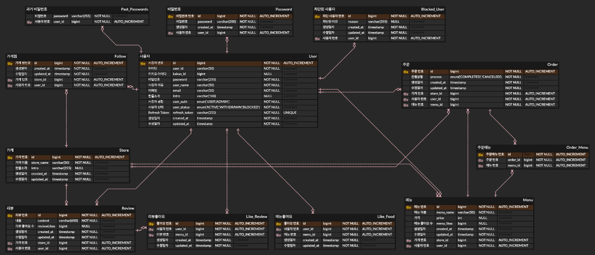

# 🪄 욕심쟁이
### *"욕심 내서 일한 자 욕심 내서 먹어라!"*
####
### 🍔 🍖 🍱 🍦 🍨 🍕 🍣 🥟 🥗 🌮 🌭 🥐
> __음식 주문 및 리뷰 작성이 가능한 음식 배달 어플리케이션__

 

## 📆 프로젝트 기간
### 2024.06.19 ~ 2024.06.25
 

## 🛠️ 개발 환경
*  __Tech__ :   
*  __IDE__ : IntelliJ
*  __JDK__ : 17
*  __DB__ : MySQL
 
 

## 🎩 팀원

* #### 김기석 [@kiseokkm](https://github.com/kiseokkm)
* #### 최영주 [@ysy56](https://github.com/ysy56)
* #### 박시현 [@sihyun615](https://github.com/sihyun615)
* #### 정연주 [@jdusw](https://github.com/jdusw)

 

## 🥁 프로젝트 내용
### 🔎 ERD
> 

 ⚙ 기능 명세서 

 
  

  
 1. 일반 사용자 기능 

  
  * __사용자 인증 기능__
  
    ✔ 회원가입 → 회원권한 부여 (사용자/관리자)
  
    ✔ 로그인 ➕ 소셜로그인(카카오)
  
    ✔ 회원탈퇴
  
    ✔ 로그아웃
  
  
  
  * __프로필 관리 기능__
  
    ✔ 프로필 조회
  
    ✔ 프로필 수정
  
    ✔ 비밀번호 수정 → 최근 사용한 세 개의 비밀번호와 달라야 수정 가능
  
  
  
  * __가게 및 메뉴 조회 기능__
  
    ✔ 가게 조회
  
    ✔ 가게 메뉴 조회
  
  
  
  * __주문 CRUD 기능__
  
    ✔ 주문 작성
  
    ✔ 주문 조회 (생성일자 기준으로 최신순) ➕ 페이지네이션
  
    ✔ 주문 수정
  
    ✔ 주문 삭제
  
  
  
  
  * __리뷰 CRUD 기능__
  
    ✔ 리뷰 작성
  
    ✔ 리뷰 조회
  
    ✔ 리뷰 수정
  
    ✔ 리뷰 삭제
  
  
  
  * __좋아요 기능__
  
    ✔ 메뉴 좋아요 등록
  
    ✔ 메뉴 좋아요 취소
  
    ✔ 리뷰 좋아요 등록
  
    ✔ 리뷰 좋아요 취소
  
  
  
  * __팔로우 기능__
  
    ✔ 가게 팔로우 하기 (가게 찜하기)
  
    ✔ 가게 팔로우 끊기
  
    ✔ 팔로우한 가게들이 등록한 메뉴 조회 (최신등록순)
  
  
  

 
  

  
 2. 관리자 기능 (백오피스) 

* __회원 관리 기능__

  ✔ 전체 회원 조회

  ✔ 특정 회원 프로필 수정

  ✔ 특정 회원 삭제

  ✔ 특정 회원 권한을 관리자로 변경

  ✔ 특정 회원 차단

* __가게 관리 기능__

  ✔ 가게 등록

  ✔ 가게 정보 수정

  ✔ 가게 삭제

  ✔ 가게 팔로우한 사용자 조회

* __메뉴 관리 기능__

  ✔ 가게 메뉴 등록

  ✔ 가게 메뉴 수정

  ✔ 가게 메뉴 삭제

  

 
 

## 🧩 Github Rules
### Branch naming
> - __작업타입/#이슈 기능__
> - ex) feat/#issueNum user

 

### Issue template
- __[Task] 이슈 제목__
> #### ISSUE
> - Group:  `user`,`board`,`like`,`commnent`
> - Type: `feat`,`update`
>
> #### 할 일
> 1. [ ] 로그인 기능 구현
>
> #### 소요 시간
> #### `3h`

- __[Bug] 이슈 제목__
> **👾 Bug**
> 
> 어떤 버그가 발생하였는지 작성해주세요.
> 
> **Bug Situation**
> 
>버그가 발생한 과정에 대해 작성해주세요:
> 1. '...'
> 2. '...'
> 3. '...'
> 4. 에러발생
>
> **Expected behavior**
> 
> 버그를 발생시킨 예상되는 원인을 작성해주세요.
>
> **Screenshots**
>
> 버그상황에 대한 영상 또는 스크린샷을 작성해주세요.
>
> **Version**
> 
> 버그가 발생한 버전 상태 등을 작성해주세요.
> - Version [__JDK__ : 17]
> 
> **Additional context**
> 
> 추가적인 내용이 있다면 작성해주세요.
> 
 

### Commit rules
> - __작업타입 : 작업 내용__
> - ex) 🎉 add : 유저 전체 조회 기능 추가

|      작업 타입       | 작업 내용  |                                 
|:----------------:|:------:|
|     ✨ update     |  해당 파일에 새로운 기능이 생김  |
|      🎉 add      | 없던 파일을 생성함, 초기 세팅 |
|     🐛 bugfix     | 버그 수정 |
|     ♻️ refactor     | 코드 리팩토링 |
|       🩹 fix       | 코드 수정 |
|      🚚 move       | 파일 옮김/정리  |
|   🔥 del    | 기능/파일을 삭제 |
|      🍻 test      | 테스트 코드를 작성 |
|  💄 style   | css |
|🙈 gitfix| gitignore 수정 |
|    🔨script     | package.json 변경(npm 설치 등) |
 

### PR title naming
> - __[날짜] 브랜치명 >> 작업내용__
> - ex) [2024.06.20] feat/#10 admin-user >> 백오피스 유저 기능 추가

### PR template
> #### #️⃣ 연관된 이슈
> 
> #이슈번호
> 
> Close #이슈번호
>
> #### 📑 작업 내용
> 
> -
>
> #### 💭 리뷰 요구사항(선택)
> ####

### PR & merge rules
1. PR 후 슬랙에 남기기
2. PR 본 사람은 코드 확인 후 리뷰 남기기
3. 리뷰 반영 후 코드 완성 시 merge

 
 

## 🍽️ 프로젝트 후기
#### 🍀 김기석
팀원분들이 적극적으로 참여해서 좋았습니다.
많은 소통이 프로젝트가 더 좋은쪽으로 갈 수 있는걸 알았으며, Oauth 인증 흐름에 대한 실질적인 이해를 할 수 있었습니다.

 

#### 🍰 최영주
이번 프로젝트를 통해 깃허브의 다양한 기능을 활용하는 법을 배우게 되었습니다. 그리고 코드컨벤션과 깃규칙 등 세부적으로 정해놓음으로써 프로젝트 진행을 효율적으로 진행할 수 있었던 점이 좋았습니다. 마지막으로 욕심내서 많은 기능을 구현하기 위해 다함께 노력했던 저희 팀 모두가 너무나 좋습니다!

 

#### 👾 박시현
 이번 프로젝트는 초기 단계에서부터 설계에 많은 고민과 노력을 기울였습니다. 시스템 아키텍처, 데이터베이스 설계, 코드 구조 등 다양한 측면에서 최적의 솔루션을 찾기 위해 많은 시간을 투자하였습니다. 진행 과정에서도 지속적으로 코드를 개선하려는 노력이 전체 프로젝트의 품질을 높이는 데 큰 도움이 되었습니다.
팀원들과의 적극적인 소통과 협업을 통해 다양한 아이디어와 시각을 접할 수 있었고, 이를 바탕으로 프로젝트를 최선의 방향으로 구현할 수 있었습니다.
 또한 프로젝트 관리 도구를 통해 일정 관리와 시간 활용의 중요성을 깨달았으며, 앞으로는 이러한 기능을 더욱 적극적으로 활용하여 프로젝트를 진행해야겠다고 생각했습니다.

 

#### 🌟 정연주
코드 컨벤션이나 깃룰스 이슈 PR 규칙을 정함으로 프로젝트의 진행사항을 알기 편하다는 것을 알게되었습니다. 팀원들간의 원활한 소통 덕에 막히는 부분이 있더라도 빠르게 진행할 수 있었던 것 같습니다. 또한 서로의 트러블 슈팅을 공유하였는데 그 덕에 몰랐던 부분도 알 수 있어 좋았습니다.
